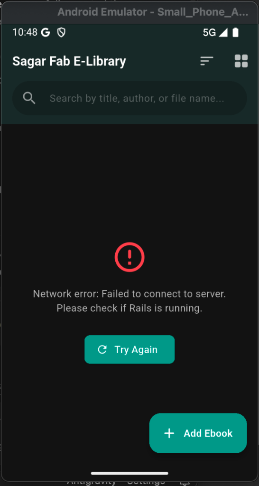

# Digital Ebook Library Application

An end-to-end product implementation for the **Sagar Fab International Company** Full Stack Developer Assignment. It features a **Ruby on Rails 8 API backend** with Active Storage and a **Flutter 3 client app** showcasing a premium, classic wooden Bookshelf UI inspired by the older iOS ebook library.



---

## Tech Stack

### Backend
- **Ruby on Rails 8.1.3** (API Mode)
- **SQLite3** (Database)
- **Active Storage** (Local storage simulation)
- **Rack CORS** (Handling Cross-Origin Resource Sharing)
- **pdf-reader** (Automated metadata extraction)
- **Minitest** (Rails testing suite)

### Frontend (Flutter)
- **Flutter 3.35.5**
- **syncfusion_flutter_pdfviewer** (Interactive PDF rendering with zoom & navigation)
- **shared_preferences** (Page memory retention)
- **file_picker** (Cross-platform file selector)
- **http** (REST Client)
- **intl** (Date & size formatting)

---

## Features

- **Classic Bookshelf UI (Bonus):** Realistic 3D wooden shelves with gradient book covers, shadows, spine bindings, and customized typography.
- **Dynamic Cover Generation:** Instead of heavy, complex system dependencies (like Ghostscript or Poppler) which often break during local evaluation, the app automatically generates uniquely stylized cover cards for each book using server-assigned premium color palettes.
- **Automated Metadata Extraction:** The backend reads uploaded PDF files, automatically extracting the Title and Author using the `pdf-reader` gem, falling back gracefully to the file name and "Unknown Author".
- **Page Memory ("Last Read Position"):** Remembers the exact page you were reading and prompts to resume from there next time you open the ebook.
- **Offline Reading Integration:** The reader automatically checks if the book is downloaded locally on the device to read offline instantly, falling back to streaming over the network.
- **Download & Delete:** Secure download endpoints with visual download progress updates in the app, and deletion confirmation flows that clean up backend storage immediately.
- **Search & Filters:** Debounced search bar (prevents hitting backend on every keystroke) with sort filters (Recent, Title, Author) and order directions.

---

## Setup & Running Instructions

Ensure you have **Ruby 3.2.2+**, **Rails 8+**, and **Flutter 3.35+** installed on your system.

### 1. Run the Backend API
```bash
# Navigate to the backend directory
cd backend

# Install Gem dependencies
bundle install

# Run database migrations and seed default library books
bin/rails db:migrate
bin/rails db:seed

# Start the Rails server
bin/rails server
```
*The Rails API will start running on [http://localhost:3000](http://localhost:3000).*

### 2. Run the Flutter Client
```bash
# From the root project directory (where pubspec.yaml resides)
flutter pub get

# Run the Flutter app (loads the simulator/emulator or desktop client)
flutter run
```
*Note: The app is configured with emulator loopbacks. If running on an Android emulator, it connects automatically to the host Rails instance via `http://10.0.2.2:3000`. On iOS or desktop, it defaults to `http://localhost:3000`.*

---

## Testing

Both frontend and backend are covered by comprehensive automated suites.

### Backend Tests
To execute the model unit tests and API controller integration tests:
```bash
cd backend
rails test
```
**Successful Execution Output:**
```text
Running 16 tests in a single process (parallelization threshold is 50)
Run options: --seed 61261

# Running:

................

Finished in 0.271713s, 58.8857 runs/s, 209.7802 assertions/s.
16 runs, 57 assertions, 0 failures, 0 errors, 0 skips
```
*Verifies PDF metadata extraction, upload limits, search indexes, file streaming downloads, and deletion cleanup.*

### Frontend Widget Tests
To run the Flutter widget tests:
```bash
flutter test
```
**Successful Execution Output:**
```text
00:01 +0: E-Library app smoke test - verify layout and loading state
00:01 +1: E-Library app smoke test - verify layout and loading state
00:01 +1: EbookCard renders title, author, and format badge correctly
00:02 +1: EbookCard renders title, author, and format badge correctly
00:02 +2: EbookCard renders title, author, and format badge correctly
00:02 +2: Search UI allows typing and clears input
00:02 +3: Search UI allows typing and clears input
00:02 +3: BookshelfView empty shelves state renders wooden shelves background
00:02 +4: BookshelfView empty shelves state renders wooden shelves background
00:02 +4: Delete confirmation dialog pops up and can be cancelled
00:02 +5: Delete confirmation dialog pops up and can be cancelled
00:02 +5: All tests passed!
```
*Verifies user search inputs, empty shelf layouts, EbookCard contents, and delete warning confirmations in isolation.*

---

## API Specification

All endpoints are namespaced under `/api`.

| HTTP Method | Endpoint | Description | Query Parameters |
| :--- | :--- | :--- | :--- |
| **GET** | `/api/ebooks` | Retrieve all ebooks | `q` (search query), `sort_by` (`title`, `author`, `recent`), `sort_order` (`asc`, `desc`) |
| **GET** | `/api/ebooks/search` | Search ebooks | `q` (search query) |
| **GET** | `/api/ebooks/:id` | Get specific book details | - |
| **POST** | `/api/ebooks` | Upload new ebook (multipart) | Form fields: `file` (PDF/EPUB binary), `title` (optional), `author` (optional) |
| **GET** | `/api/ebooks/:id/download` | Download ebook binary | - |
| **DELETE** | `/api/ebooks/:id` | Delete ebook & attachment | - |

---

## AI Tools Usage & Self-Evaluation

This application was developed using **Antigravity** (Google DeepMind's agentic AI pair-programming assistant) working in tandem with the developer.

### AI-Assisted Components
- **Architecture Design:** Defining the directory layout, separating concerns between client and server, and modeling the SQLite schema.
- **Bookshelf UI & Book Cover Widget:** Creating the responsive shelf-chunking grid math and styling the 3D leather/fold bindings of the `EbookCard` in Flutter.
- **Debounced Search:** Implementing the inline timer debounce algorithm to prevent API throttling during typing.
- **Continue Reading Horizontal Slider:** Creating the horizontal listing section that queries `SharedPreferences` locally.
- **Cover Image & Rich Text Highlighting:** Implementing custom cover multipart uploading and the case-insensitive search matching highlight algorithm.

### Developer Modifications & Critical Auditing
- **Active Storage gotcha:** An initial AI plan attempted to read the file metadata `before_validation` by running `file.open`. The developer corrected this since Active Storage does not upload or write the file to the disk service until the record transaction is committed (causing `ActiveStorage::FileNotFoundError`). The developer refactored the extraction method to parse the temporary file directly from `attachment_changes` before saving.
- **Layout Overflows Debugging:** During active execution on emulator layouts, the developer caught two key overflow bugs:
  1. *Vertical card overflow:* Small covers (height < 100) overflowed due to author and title dimensions. Guided the AI to hide titles/authors on small list view/details sheet thumbnails while displaying format badges.
  2. *Horizontal metadata list view overflow:* Guided the AI to replace a static `Row` layout with a dynamic `Wrap` widget to prevent text overflow on narrow devices.
- **Type Safety & Up-to-date SDK Deprecations:** The developer manually fixed compiler type errors in `upload_dialog.dart` (converting dynamic bytes to `List<int>`) and corrected deprecated parameter styles (such as changing `BottomAppBarTheme` and `DialogTheme` structures to `BottomAppBarThemeData` and `DialogThemeData` classes as required by Flutter 3's Material 3 theme engine).

---

## Known Limitations

- **File Formats:** While the backend database is prepared to register both PDF and EPUB content types, the client-side reader (`syncfusion_flutter_pdfviewer`) only renders PDFs. For EPUBs, it acts as a catalog manager (allowing upload, download, search, and deletion).
- **SQLite Database:** The SQLite3 database is file-based and resides inside the backend local directory. Running the app in a stateless environment (like Heroku or Docker containers without persistent volumes) will reset data on restarts.
