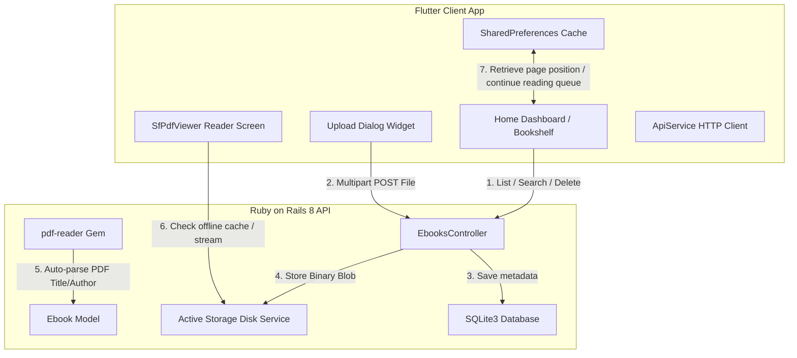

# Digital Ebook Library Application - Engineering Design & Product Reasoning

This document outlines the core technical architecture, design patterns, and **product reasoning** behind the implementation choices for the Digital Ebook Library Application.

---

## 1. System Architecture & Tech Stack Decisions

The system is separated into a Rails API backend and a Flutter client app. This clean separation of concerns ensures that either component can be upgraded, rewritten, or scaled independently.

### **1.1. Why Rails API Mode?**
*   **Reasoning:** Generating HTML templates server-side (using Rails ERB/Hotwire) binds the backend strictly to web views. Using Rails in API-only mode (`--api`) forces the backend to output clean, structured JSON payloads. This permits the Flutter app (or any future web/desktop client) to consume database attributes via standardized endpoints.

### **1.2. Why SQLite3?**
*   **Reasoning:** SQLite3 is file-based and requires zero background database server installation (unlike PostgreSQL or MySQL). For a coding assignment meant to be evaluated locally on different developer machines, SQLite3 guarantees that running `bin/rails db:migrate` works immediately without configuration issues.

### **1.3. Why Active Storage?**
*   **Reasoning:** Instead of writing custom file-upload path handlers and disk cleanup jobs, Active Storage abstractly handles binary streaming out-of-the-box. It links file attachments directly with ActiveRecord lifecycle transactions and easily abstracts transitioning from local disk storage to cloud providers (like Amazon S3 or Google Cloud Storage) via a simple YAML configuration change.

---

## 2. Backend Logic Rationale

### **2.1. File Size Constraints (50MB Limit)**
*   **Reasoning:** Large PDF/EPUB documents cause HTTP request timeouts and bloat local server disk storage. Enforcing a strict 50MB limit maintains database responsiveness while easily accommodating standard text-heavy novels and document textbooks.

### **2.2. Automated PDF Metadata Extraction**
*   **Reasoning (Reducing Cognitive Load):** Manual data entry is a point of friction. Users uploading files in bulk do not want to type titles and authors for every document. By reading the PDF's header metadata stream in memory using `pdf-reader` during upload, the backend automatically defaults the Title and Author, letting the user upload files in one click.
*   **Fallback Strategy:** If the PDF file lacks internal tags, the backend defaults to the clean file name and `"Unknown Author"` instead of failing or leaving fields blank, ensuring the library listings remain consistent.

### **2.3. Dynamic Cover Spine Gradients vs. Server Image Rendering**
*   **The Trade-Off:** Standard ebook library apps try to render the first page of a PDF as a cover thumbnail. However, doing so server-side requires native Unix rendering packages (such as Ghostscript, Poppler, or MuPDF) wrapped in ImageMagick. These libraries are notoriously difficult to compile locally on target machines and significantly slow down upload times.
*   **Our Decision:** The backend automatically generates two matching color hex gradients (e.g. `cover_color_start` and `cover_color_end`) when a record is saved. The client app uses these hex values to render a gorgeous 3D leather-spine cover dynamically in Flutter. This is fast, has zero operating system dependencies, compiles instantly on any machine, and gives the bookshelf a cohesive, visual aesthetic.
*   *Custom Overrides:* If a user prefers a custom cover image, the API supports an optional `cover_image` multipart attachment, rendering the image dynamically on the card via `Image.network` with smooth loading shimmer indicators.

---

## 3. Frontend UX & Design Decisions

### **3.1. The 3D Mahogany Bookshelf UI**
*   **Reasoning:** A simple grid of list items feels plain and lacks character. By designing a visual bookshelf layout with mahogany wood panels, dynamic gradients, spine borders, paper-fold shadows, and glassmorphic top headers, we evoke iBooks-style visual nostalgia. This turns catalog management into an engaging, tactile experience.
*   **Empty State Onboarding:** A completely blank library can make users feel like the app is empty or broken. When no books exist, the app renders empty shelves with a translucent overlay containing clear onboarding prompts. This guides the user on how to populate their shelf immediately.

### **3.2. "Continue Reading" Horizontal Slider**
*   **Reasoning (User Path Optimization):** Ebook readers rarely finish a book in one sitting, and they usually cycle between 2 or 3 active books. Forcing the user to scroll through a library of 100+ items to find their active read creates friction. Pinned at the top of the dashboard, the "Continue Reading" slider displays the top 5 recently read books, letting users resume reading in a single tap immediately upon booting the app.

### **3.3. Last Read Page Memory**
*   **Reasoning:** Readers hate losing their place. Storing the page progress locally in `SharedPreferences` (keyed by book ID) is a lightweight solution that avoids database writes on every page change. This guarantees page memory works completely offline and restores progress under 100ms when reopening a book.

### **3.4. Smart Offline Caching**
*   **Reasoning:** Ebooks are frequently read on the go (subways, planes) where internet connections are spotty or non-existent. When a user opens a book, the app checks if the binary exists in the device's local documents folder. If present, it loads the file locally, saving mobile data and battery while bypassing network latency.

### **3.5. Search Debouncing (500ms Delay)**
*   **Reasoning:** Listening to search text changes and querying the API on every single keystroke causes "HTTP request storms." If a user types "Gatsby" (6 characters), it fires 6 queries in less than a second, causing layout flickering on the client and database locking on the server. Debouncing waits for the user to pause typing before sending a single HTTP request, optimizing system performance.

### **3.6. Grid/List Layout Card Overflow Protection**
*   **Vertical Overflow Fix:** On small screen scales (like detail bottom-sheets or list view thumbnails with a height < 100), displaying titles and authors causes vertical RenderFlex overflows. We set card height checks to automatically hide cover text on smaller scales, keeping visual layout badges clean and stable.
*   **Horizontal Overflow Fix:** In `ListView`, metadata elements (format, file size, upload date) can exceed screen width on narrow devices. We replaced a static `Row` with a responsive `Wrap` widget to prevent horizontal pixel overflows on narrow devices.

---

## 4. Testing Philosophy

*   **Backend integration tests (`rails test`):** Rather than unit testing simple data models, we focus on API integrations. Tests mock multipart uploads, file formats validations, download binaries streaming, and cascade deletions. This guarantees endpoint contracts never break.
*   **Frontend widget tests (`flutter test`):** Rather than testing state frameworks, we focus on visual stability. Tests verify text debouncers, search bar clear buttons, empty bookshelf layout rendering, and delete dialog confirmations.
