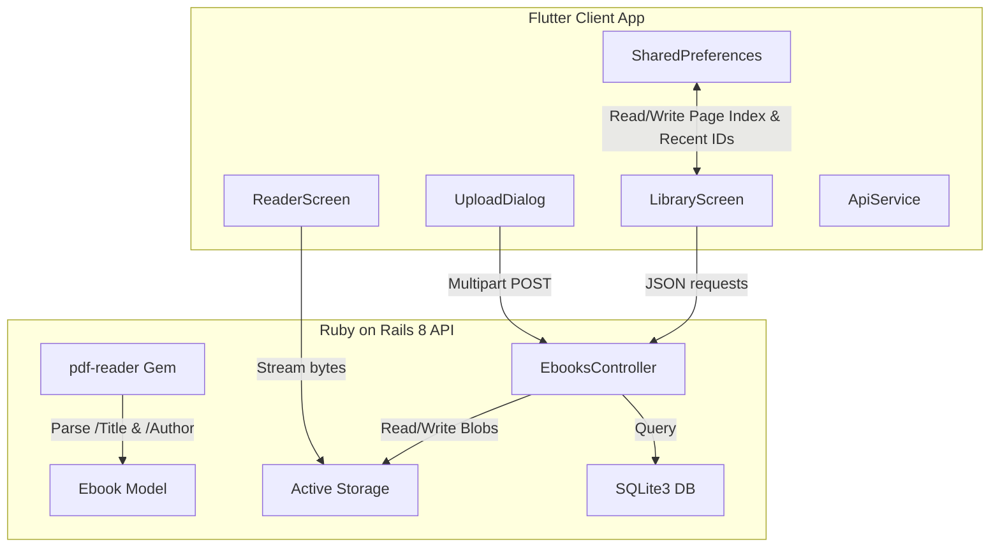

# Digital Ebook Library Application - Exhaustive Architecture Blueprint & Code Walkthrough

This document provides a highly detailed file-by-file code walkthrough mapping out the technologies, design patterns, state variables, classes, and methods implemented in the application.

---

## 1. System Architecture Overview & Tech Stack

The application uses an API-first, client-server model. The backend serves structured JSON metadata and streams raw file binaries, while the client app manages local file caching, reading state progress, and user interactions.

---

## 2. Backend Implementation (Ruby on Rails 8)

### **2.1. Ebook Database Model**
*   **File Path:** [ebook.rb](file:///Users/uthai/Projects/flutter/projects/scottinternational/backend/app/models/ebook.rb)
*   **Technologies:** ActiveRecord, Active Storage, `pdf-reader` Gem.
*   **Engineering Patterns:** Callback Lifecycle, Declarative Validations, Defensive Programming.
*   **Detailed Class Walkthrough:**
    *   `has_one_attached :file`: Connects the record to the Active Storage attachment blob manager (PDF or EPUB binary).
    *   `has_one_attached :cover_image`: Connects the record to an optional image attachment (JPEG/PNG/WebP) to override the default gradient cover.
    *   **Validations:**
        *   `validates :title, presence: true`: Ensures every record has a title for database querying consistency.
        *   `validate :file_presence`: Verifies that an attachment is uploaded during record creation.
        *   `validate :file_format_and_size`: Checks the metadata of the attached file. Rejects files larger than 50MB and limits MIME types strictly to `application/pdf` and `application/epub+zip`.
    *   **Callbacks:**
        *   `before_validation :extract_pdf_metadata, on: :create`: Evaluates the attachment in the temporary upload cache. If it is a PDF and the user has not typed a custom Title/Author, it initiates `PDF::Reader` in memory, extracts the internal `/Title` and `/Author` tags, and auto-fills the model.
        *   `before_validation :generate_cover_colors, on: :create`: Selects a start and end hex color from a predefined palette of gradients (e.g. mahogany, teal, navy) and saves them, establishing a dynamic cover fallback.
    *   **Helper Methods:**
        *   `as_json(options)`: Overrides default serialization. Automatically appends absolute Rails URLs for both file downloads (`download_url`) and cover images (`cover_url`), letting the client access binaries directly.

---

### **2.2. Ebooks API Controller**
*   **File Path:** [ebooks_controller.rb](file:///Users/uthai/Projects/flutter/projects/scottinternational/backend/app/controllers/api/ebooks_controller.rb)
*   **Technologies:** Rails ActionController, Active Storage Blob URLs, Database Query Filters.
*   **Engineering Patterns:** RESTful Action Mapping, Parameter Whitelisting (Strong Params).
*   **Detailed Controller Methods Walkthrough:**
    *   `index`: Retrieves books. It reads parameters:
        *   `params[:q]`: Filters database records by title, author, or original filename (using SQL `LIKE` keywords).
        *   `params[:file_type]`: Filters records by PDF (`application/pdf`) or EPUB (`application/epub+zip`) MIME types.
        *   `params[:sort_by]` & `params[:sort_order]`: Dynamically orders records (e.g., sorting by recently uploaded, alphabetical author, or title).
    *   `show`: Returns the JSON representation of a single ebook metadata model.
    *   `create`: Sanitizes parameters using `ebook_params` (Strong Parameters), saves the file, runs metadata extraction in the model transaction, and returns a `201 Created` payload.
    *   `download`: Retrieves the Active Storage file and streams the binary to the client using `send_data` with inline or attachment disposition, allowing download chunk progress tracking.
    *   `destroy`: Triggers model deletion. Cleans up the database row and purges the file from disk storage.

---

## 3. Frontend Implementation (Flutter 3)

### **3.1. Network Client Service**
*   **File Path:** [api_service.dart](file:///Users/uthai/Projects/flutter/projects/scottinternational/lib/services/api_service.dart)
*   **Technologies:** Dart `http` package, `path_provider` directory handlers.
*   **Engineering Patterns:** Service Locator, Async Data Streaming.
*   **Detailed Method Walkthrough:**
    *   `fetchEbooks(...)`: Serializes sorting, filtering, and query strings, executes a `GET` request to `/api/ebooks`, and returns a mapped list of Dart `Ebook` models.
    *   `uploadEbook(...)`: Coordinates multipart form uploads. Constructs an `http.MultipartRequest` post stream, attaches the PDF/EPUB document and optional cover image byte streams, appends text parameter strings, and executes the network request.
    *   `downloadEbook(...)`: Downloads a file. It initiates an HTTP `GET` to `/api/ebooks/:id/download` and reads the raw byte stream chunks. For each chunk received:
        - Calculates current progress ratio: `bytesDownloaded / totalContentLength`.
        - Triggers the visual UI progress callback function inside the client screen.
        - Writes completed bytes to the device's documentation folders (`ApplicationDocumentsDirectory`).
    *   `deleteEbook(id)`: Sends a `DELETE` request to clear the database entry on the backend.

---

### **3.2. Library Screen (The Dashboard)**
*   **File Path:** [library_screen.dart](file:///Users/uthai/Projects/flutter/projects/scottinternational/lib/screens/library_screen.dart)
*   **Technologies:** Material 3, SharedPreferences, Custom Switch Router.
*   **Engineering Patterns:** Observer/Listener, Debounced Typing, Responsive Row Containment.
*   **State Variables Walkthrough:**
    *   `List<Ebook> _ebooks`: Stores the complete list of books fetched from the server.
    *   `bool _isLoading`: Triggers the global circular loading state.
    *   `String _searchQuery`: Stores the active search query.
    *   `String _sortBy`: Stores the active sort column (default: `"recent"`).
    *   `String _sortOrder`: Stores the active sort direction (default: `"desc"`).
    *   `String _fileTypeFilter`: Stores the active format filter (`"all"`, `"pdf"`, or `"epub"`).
    *   `List<Ebook> _recentlyReadEbooks`: Stores up to 5 book models fetched and ordered by recently read indices in local storage.
    *   `_ReaderDownloadProgress? _downloadState`: Holds references to the active downloading book ID and percentage value for rendering the bottom loader banner.
*   **Core Methods Walkthrough:**
    *   `_fetchBooks()`: Invokes `ApiService.fetchEbooks()` using the active state search, sort, and filter variables, then triggers `_loadRecentlyRead()`.
    *   `_onSearchChanged(query)`: Listens to text entries inside the search search field. Instantiates a 500ms `Timer` to debounce queries, cancelling previous timers on keystrokes to prevent database request storms.
    *   `_openReader(ebook)`: Reads the local `recently_read_books` SharedPreferences StringList, moves the selected book ID to index `0`, limits the list to `5` items, and saves it. Navigates to `ReaderScreen` and calls `_loadRecentlyRead()` on return to update the slider immediately.
    *   `_loadRecentlyRead()`: Reads saved IDs from SharedPreferences and filters the loaded `_ebooks` list to match them.
    *   `_buildRecentlyReadSection()`: Renders the horizontal **"Continue Reading"** slider. Displays small, spine-less book cards, authors, titles, and format badges inside a horizontally scrolling `ListView`.
    *   `_downloadBook(ebook)`: Triggers `ApiService.downloadEbook()`. Sets the active download progress state to render the bottom progress banner. If successful, clears the banner and displays a green SnackBar with a **READ NOW** action button.
    *   `_confirmDelete(ebook)`: Spawns an `AlertDialog` warning that deletion is permanent. Tapping **Delete** triggers `_deleteBook(ebook)`.
    *   `_deleteBook(ebook)`: Calls `ApiService.deleteEbook()`, removes the local downloaded file (if cached), updates the list via `_fetchBooks()`, and clears the book from the "recently read" list.

---

### **3.3. PDF Reader Screen**
*   **File Path:** [reader_screen.dart](file:///Users/uthai/Projects/flutter/projects/scottinternational/lib/screens/reader_screen.dart)
*   **Technologies:** `syncfusion_flutter_pdfviewer`, SharedPreferences, Path Provider, Fullscreen System Overlays.
*   **Engineering Patterns:** Navigation Lifecycle Hooks, Repository Caching.
*   **State Variables Walkthrough:**
    *   `late PdfViewerController _pdfViewerController`: Controls canvas scale attributes and page navigation coordinates.
    *   `bool _isLoading`: Renders reading indicators during file loading.
    *   `bool _isLocal`: Tracks if the file is loaded from device local storage or remote stream.
    *   `File? _localFile`: Holds the local document file pointer.
    *   `int _currentPage` & `_totalPages`: Stores page counts.
    *   `bool _isFullscreen`: Controls visibility of toolbar overlays.
    *   `double _zoomLevel`: Stores current page zoom magnification scale.
*   **Core Methods Walkthrough:**
    *   `_checkLocalFileAndLoad()`: Resolves target filenames in the app documents directory. If the file exists, updates `_localFile` and set `_isLocal = true` to load from disk. Otherwise, streams from the remote URL.
    *   `_restoreLastReadPosition()`: Reads the page index saved under `ebook_read_position_[id]` from SharedPreferences. If present and valid, jumps to that page and shows a resume SnackBar.
    *   `_saveReadPosition(page)`: Runs inside `onPageChanged` page listener hooks to write the active page number back to `SharedPreferences` instantly.
    *   `_isFullscreen` triggers: Uses `SystemChrome.setEnabledSystemUIMode` to hide system status bars and navigation panels, giving a spacious reading view.
    *   `_zoomIn()` / `_zoomOut()` / `_resetZoom()`: Modifies `_pdfViewerController.zoomLevel` between `1.0` and `3.0` constraints.
    *   `_showJumpToPageDialog()`: Prompts an overlay input dialog allowing users to enter a page number and jump there via `_pdfViewerController.jumpToPage(page)`.

---

### **3.4. Custom Painted Bookshelf UI**
*   **File Path:** [bookshelf_view.dart](file:///Users/uthai/Projects/flutter/projects/scottinternational/lib/widgets/bookshelf_view.dart)
*   **Pattern:** Layout Partitioning, Math Constraints.
*   **Core Logic Walkthrough:**
    *   `build(BuildContext context)`: Computes the screen width. Resolves how many books fit in a single row (using dynamic columns math: `cols = max(2, width ~/ 110.0)`).
    *   Renders a stack:
        1.  **Background Wall:** A dark wood-grain mahogany asset pattern container.
        2.  **Shelves List:** A `ListView.builder` that partitions the books list into rows. Under each row, it draws a wooden shelf board using linear gradients, borders, and dark shadow drops to create a 3D effect.

---

### **3.5. 3D Ebook Cover Card Widget**
*   **File Path:** [ebook_card.dart](file:///Users/uthai/Projects/flutter/projects/scottinternational/lib/widgets/ebook_card.dart)
*   **Pattern:** Visual Shading Decorator, Constraint Boundaries.
*   **Core Logic Walkthrough:**
    *   Draws a 3D book cover:
        - Uses a `BoxDecoration` containing a `LinearGradient` mapped from the book's `coverColorStart` and `coverColorEnd` database hex values.
        - Adds a dark left shadow border to represent a leather book spine.
        - Adds a translucent white glossy layer to simulate page fold sheen reflections.
    *   **Vertical Containment Bounds:** If the card height is smaller than `100.0` (as in small list views or detail sheets), it hides the title and author texts. This prevents `RenderFlex` layout overflows on small preview dialogs.

---

### **3.6. Highlighted Text Search Matcher**
*   **File Path:** [highlighted_text.dart](file:///Users/uthai/Projects/flutter/projects/scottinternational/lib/widgets/highlighted_text.dart)
*   **Pattern:** Regular Expression Tokenizer.
*   **Core Logic Walkthrough:**
    *   If the `query` string is empty, returns a standard `Text` widget.
    *   If a search query is present, it constructs a case-insensitive regular expression: `RegExp(query, caseSensitive: false)`.
    *   Uses `allMatches(text)` to find all matching text blocks.
    *   Splits the text string into match segments and non-match segments. Non-match segments are rendered as normal white text, while matching blocks are wrapped inside a `TextSpan` styled with a teal background color, lighting up matches dynamically.
