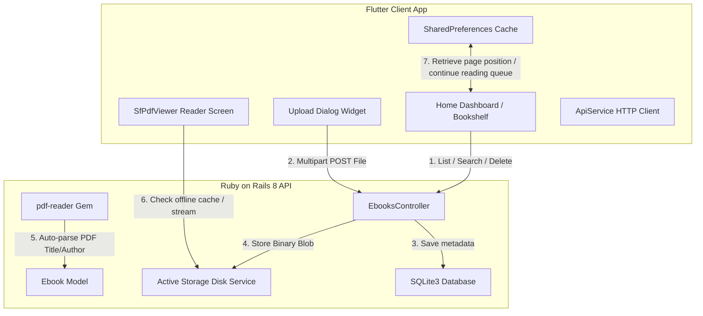

# Digital Ebook Library Application - Project Explanation Document

This document provides a comprehensive technical overview and explanation of the **Digital Ebook Library Application** built for the Sagar Fab International Company assignment. 

---

## 1. System Architecture

The application is built on a clean client-server architecture separating the database operations (Ruby on Rails 8 API) from the visual presentation layer (Flutter 3 Client App):

---

## 2. Backend Design (Ruby on Rails 8)

The backend is built in Rails API-only mode, keeping the application lightweight, fast, and secure.

### Database Schema
The database uses SQLite3 and maps ebooks to binaries via Rails Active Storage.

#### **Ebook Table Schema (`ebooks`):**
| Field | Type | Description |
| :--- | :--- | :--- |
| `id` | `integer` | Primary key |
| `title` | `string` | The title of the ebook (auto-extracted or manually overridden) |
| `author` | `string` | The author of the ebook (auto-extracted or manually overridden) |
| `cover_color_start` | `string` | Dynamic gradient start hex code (e.g., `#1A365D`) |
| `cover_color_end` | `string` | Dynamic gradient end hex code (e.g., `#2A4365`) |
| `created_at` | `datetime` | Database creation timestamp |
| `updated_at` | `datetime` | Database last update timestamp |

#### **Active Storage Mappings:**
*   `file`: Represents the binary document file (PDF or EPUB).
*   `cover_image`: Represents an optional custom JPEG/PNG cover upload.

### Core Business Logic (`ebook.rb`)
1.  **Format Validation:** Rejects any document that is not a PDF (`application/pdf`) or EPUB (`application/epub+zip`).
2.  **Size Restriction:** Enforces a strict 50MB file size limit to prevent database bloat.
3.  **PDF Metadata Extraction:** Utilizes `pdf-reader` in a `before_validation` callback. If the uploaded file is a PDF, it parses the binary file structure in memory, extracts `/Title` and `/Author` tags, and assigns them automatically if the user left the input fields blank.
4.  **Automatic Cover Spine Generation:** When a book is saved, the model automatically generates and stores two harmonizing hex gradient colors (e.g., `cover_color_start` and `cover_color_end`) so the bookshelf has a rich, premium look.

---

## 3. API Specification

All endpoints are namespaced under `/api` and communicate via JSON:

| Method | Route | Description | Query Parameters |
| :--- | :--- | :--- | :--- |
| **GET** | `/api/ebooks` | Fetch catalog list | `q` (search keywords), `sort_by` (`recent`, `title`, `author`), `sort_order` (`asc`, `desc`), `file_type` (`pdf`, `epub`) |
| **POST** | `/api/ebooks` | Upload document | Multipart Form fields: `file` (binary), `cover_image` (optional binary), `title` (optional string), `author` (optional string) |
| **GET** | `/api/ebooks/:id` | Fetch detailed record | - |
| **GET** | `/api/ebooks/:id/download` | Stream binary attachment | Downloads the file as an attachment (`disposition: attachment`) with proper MIME headers |
| **DELETE** | `/api/ebooks/:id` | Wipe record & binaries | Cascades deletion to Active Storage blob allocations and wipes files from disk |

---

## 4. Frontend Architecture (Flutter 3)

The Flutter application is structured around single-responsibility layout screens and custom reusable widgets:

### Key Directories
*   `lib/models/ebook.dart`: Holds the parsed book structure.
*   `lib/services/api_service.dart`: Handles HTTP REST client connections and handles downloading progress chunks.
*   `lib/screens/library_screen.dart`: The home dashboard hosting the view mode controller, search triggers, filtering options, and download overlays.
*   `lib/screens/reader_screen.dart`: Houses the `SfPdfViewer` reader view, zooming tools, fullscreen selectors, and page navigation controls.
*   `lib/widgets/bookshelf_view.dart`: Generates the classic wood-themed shelf lists dynamically based on screen width dimensions.
*   `lib/widgets/ebook_card.dart`: Draws the 3D book cover graphics using custom gradients, left spine shadow bindings, glossy paper reflections, and metadata banners.
*   `lib/widgets/highlighted_text.dart`: High-performance text parsing spans that highlight matched search terms case-insensitively.

### Key Client-Side Features
1.  **Classical Wood Bookshelf (Bonus):** Calculates dynamic page shelf rows matching screen width, drawing 3D-shadowed wooden shelves underneath. If the library is empty, it renders three empty shelves with a translucent dark card.
2.  **Continue Reading Slider (Bonus):** Tapping any book cover registers its ID into local `SharedPreferences` cache logs (limited to 5 items). The dashboard displays these as a horizontal scroll queue at the top of the shelf.
3.  **Last Read Page Memory (Bonus):** Saves the page scroll position to `SharedPreferences` on change events inside the PDF viewer. Restores the reader to that exact page upon reopen with a toast alert.
4.  **Smart Offline Mode (Bonus):** The reader automatically verifies if a copy of the PDF binary exists in the device's local document directory. If found, it loads offline instantly, bypasses network requests, and renders an "Offline Mode" title banner.
5.  **Search Highlighting:** Renders matches in titles or authors with a teal highlighted background.

---

## 5. Product & Design Thinking Choices

*   **Responsive layouts:** Uses `Wrap` elements instead of fixed `Row` blocks to avoid horizontal overflows on narrow devices.
*   **Vertical containment:** Hides title text on ebook cover cards smaller than `100.0` pixels to avoid vertical overflow, keeping thumbnails clean.
*   **Upload safety:** Input fields are locked during multipart requests, and the upload dialog preserves user entries if an upload fails so they do not have to type title/author details again.
*   **Search debouncing:** Utilizes a `500ms` debounce timer inside search controllers to bundle keystrokes, avoiding layout flickering and unnecessary server API spam.
